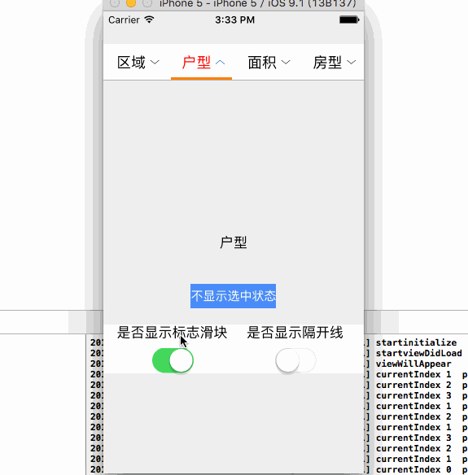

# LXToolBar
使用AutoLayout实现的工具条，比较适合用于自定义Tabbar、下拉选择Bar等。
等比例布局它上面的各个Item，并支持AutoLayout。

###图示如下：


###CocoaPods接入
`pod 'LXToolBar', '~> 0.2'`

###使用方法
```objc
#pragma mark - LXToolBarDelegate
//Item数量
- (NSInteger)numberOfItemsInToolBar:(LXToolBar *)toolBar {
    
    return _itemNames.count;
}

//创建每个Item
- (UIControl *)toolBar:(LXToolBar *)toolBar itemForIndex:(NSInteger)index {
    
    LXLayoutButton * button = [LXLayoutButton buttonWithType:UIButtonTypeCustom];
    button.subMargin = 5.0;
    button.layoutButtonType = LXLayoutButtonTypeRight;
    [button setImage:[UIImage imageNamed:@"down_arrow"] forState:UIControlStateNormal];
    [button setImage:[UIImage imageNamed:@"up_arrow"] forState:UIControlStateSelected];
    [button setTitle:_itemNames[index] forState:UIControlStateNormal];
    [button setTitleColor:[UIColor redColor] forState:UIControlStateSelected];
    [button setTitleColor:[UIColor blackColor] forState:UIControlStateNormal];
    
    return button;
}

//创建一个贴着ToolBar底部，点击后会滑动的滑块
- (UIView *)selectedTagViewForToolBar:(LXToolBar *)toolBar {
    //通过Frame可以设定此View的大小
    CGFloat widht = CGRectGetWidth([UIScreen mainScreen].bounds) / _itemNames.count - 5;
    UIView * tagView = [[UIView alloc] initWithFrame:CGRectMake(0, 0, widht, 3)];
    tagView.backgroundColor = [UIColor orangeColor];
    return tagView;
}

//选中Item执行的回调
- (void) toolBar:(LXToolBar *)toolBar didSelectItemAtIndex:(NSInteger)currentIndex previousSeleectedItemIndex:(NSInteger)previousIndex {
    NSLog(@"currentIndex %@  previousIndex %@", @(currentIndex), @(previousIndex));
    _label.text = _itemNames[currentIndex];
}

```

###提供的接口
```objc
@property (weak, nonatomic) IBOutlet id <LXToolBarDelegate> delegate;

/*! 画一根下部的分割线,若设为Yes,则会将isDrawTopSepLine设为NO */
@property (assign, nonatomic) BOOL isDrawBottomSepLine;

/*! 画一根上部的分割线若设为Yes,则会将isDrawBottomSepLine设为NO */
@property (assign, nonatomic) BOOL isDrawTopSepLine;

/*! 是否显示每个item之间的分割线 */
@property (assign, nonatomic) BOOL isShowSeparatorLine;

/*! 是否隐藏滑块 */
@property (assign, nonatomic) BOOL isShowSelectedTag;

/*! 分割线的EdgeInsets,只有上下的值会生效 */
@property (assign, nonatomic) UIEdgeInsets separatorLineInsets;
@property (strong, nonatomic) UIColor *separatorLineColor;
@property (strong, nonatomic) UIImage *separatorImage;

/*! 选中的下标 */
@property (assign, nonatomic) NSInteger selectedIndex;

/*! 隐藏当前选中状态 */
- (void) hiddenCurrentSelectedStatus;

/*! 重新加载所有的Items */
- (void) reloadAllItems;
```

###接口使用：
```objc
- (IBAction)buttonClick:(id)sender {
    //隐藏ToolBar的选中状态
    [_toolBar hiddenCurrentSelectedStatus];
}

- (IBAction)isShowSelectedTagSwitchValueChanged:(id)sender {
    UISwitch * curSwitch = (UISwitch *)sender;
    _toolBar.isShowSelectedTag = curSwitch.isOn;
    [_toolBar reloadAllItems];
}

- (IBAction)isShowItemsSeparatorLineSwitchValueChanged:(id)sender {
    UISwitch * curSwitch = (UISwitch *)sender;
    _toolBar.isShowSeparatorLine = curSwitch.isOn;
    [_toolBar reloadAllItems];
}
```
